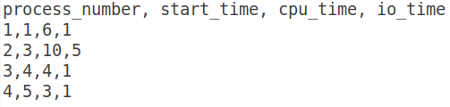

**CPSC 410**

**Project 1**

## Motivation: Get used to C++ again

## Overview

You are given a file that has an [unknown number]{.ul} of rows, and 4
columns of integers that looks like the following. Note that all values
are separated by commas.

This file can have any name, but I will call it testdata.txt for the
purposes of this document. The first row describes each columns
function, skip this row when reading data. You also have to handle files
that do not have the row of column names.

I have provided a header file (utilities.h) which describes the API that
you are to generate. Please generate the corresponding utilities.cpp.
This API defined in this file is responsible for reading data from a
given file, handling whether the first row has column labels or not ,
handling corrupt data (see below) and sorting the data.

## Input Data:

I have provided 3 separate sample input files; 1 with column headings
(TestData_Heading.txt), 1 without column headings
(TestData_NoHeading.txt), and 1 without column headings containing
corrupt data (TestData_NoHeading_CORRUPTED_ROWS.txt).

## Corrupt data may present itself in the following ways [only]{.ul};

1.  Any row that is missing 1 or more commas is corrupted

2.  Any row that has less than 4 numeric columns is corrupted

As you can imagine, there are many other ways that data can be
corrupted, but ignore those for now. Please discard corrupted rows.

## Running project

The main() function resides in fileio.cpp. It runs several tests against
utilities.cpp. Currently it generates a grade of 0, your task is to get
this to 100 by correctly filling in content to utilities.cpp.

## Your task

1.  Complete utilities.cpp and turn it in. Please see utilities.h for
    required content. You can add any additional content that you would
    like to utilities.cpp just as long as you complete the required
    functions. Please be sure [not]{.ul} to modify utilities.h since you
    are not submitting this file thus I will not see your changes.

## To Turn In

utilities.cpp only

## Grading

I will drop your utilities.cpp file in a clean 410_Proj1_Student
project. I will run the project to determine your grade.

## APIs that may help

std::string

std::vector

stringstream

std::getline

ifstream and ofstream

std::sort
